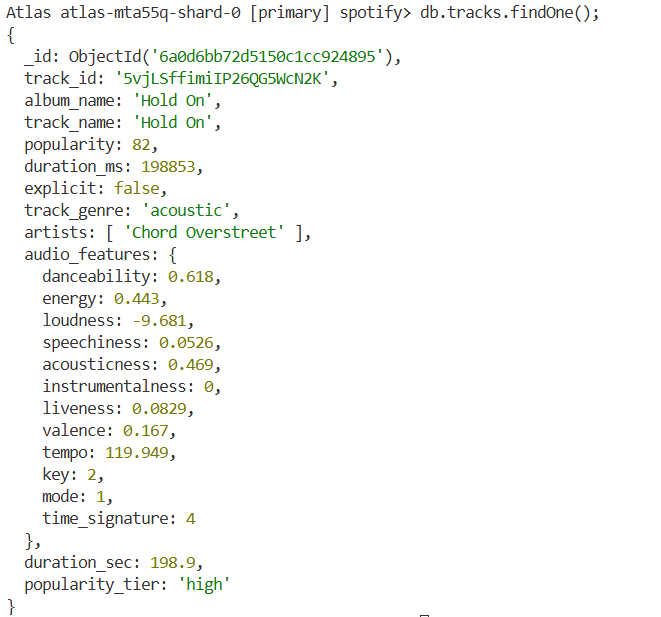
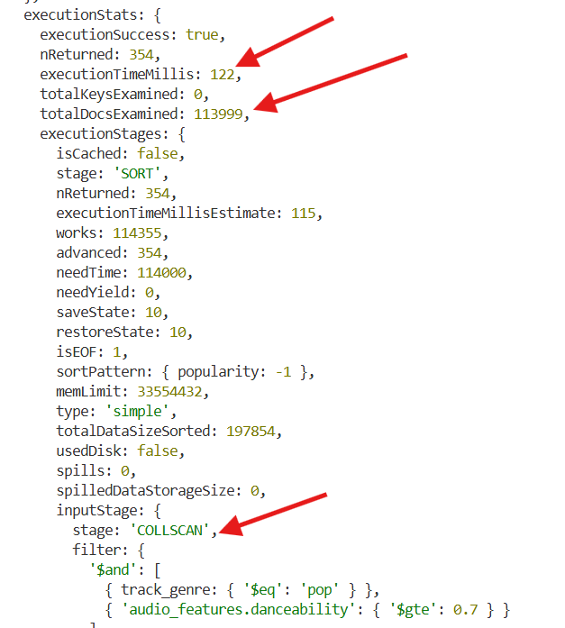
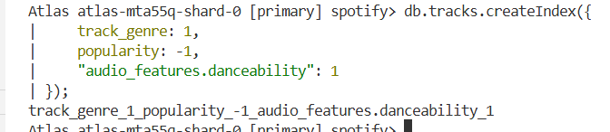
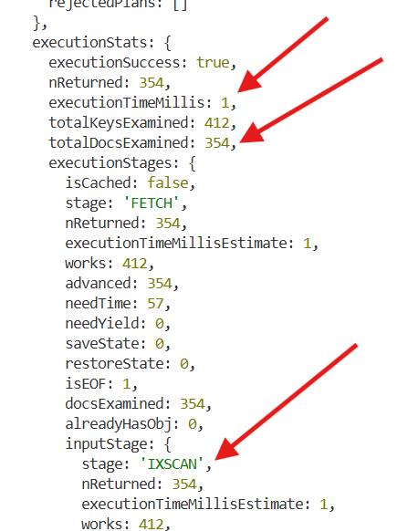
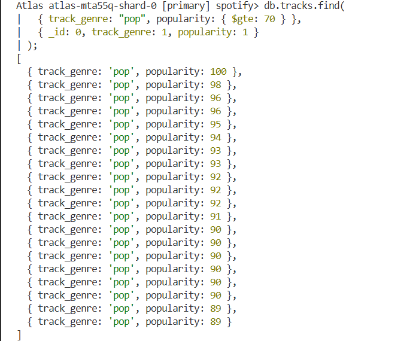

# Вимоги до оточення
* Python (версії __3.9__ або вище)
* MongoDB Shell (mongosh). Її необхідно завантажити та додати до системних змінних (PATH), або вказувати повний шлях при запуску __.js__ скриптів.
* Активний кластер __MongoDB Atlas__

# Налаштування середовища та встановлення залежностей
* Створення віртуального середовища Python: 
```
python -m venv .venv
```
* Активація віртуального середовища: 
```
.\.venv\Scripts\Activate.ps1 (Windows)

source .venv/bin/activate (Linux)
```
* Встановити необхідні бібліотеки: 
```
pip install -r requirements.txt
```

# Налаштування змінних оточення
* У корені проєкту знайдіть файл __.env.example__. 
* Зробіть його копію і назвіть її __.env__ (файл додано до .gitignore).
* Відкрийте файл .env та заповніть ваші дані підключення: підставте ваш логін та пароль

# Порядок запуску скриптів
Усі скрипти знаходяться в папці __scripts/__ і мають запускатися в чіткій послідовності:
1. Завантаження "сирих" даних python __scripts/01_load_data.py__. Python-скрипт читає дані з CSV-файлу та завантажує їх у колекцію tracks_raw.
```
python scripts/01_load_data.py
```
2. Трансформація та очищення даних відбувається в файлі __02_transform.js__. Цей скрипт обробляє колекцію __tracks_raw__, створює вкладені об'єкти та зберігає готовий результат у фінальну колекцію __tracks__.
Запуск файлу:
```
mongosh "ваша_строка_підключення_до_MongoDB з .env файлу" --file scripts/02_transform.js
```
# Аналітичні запити (частина 2-4)
Після успішної трансформації можна запускати аналітичні скрипти:

__ЧАСТИНА 2:__
```
mongosh "ваша_строка_підключення" --file queries/part2_queries.js
```
__ЧАСТИНА 3:__
```
mongosh "ваша_строка_підключення" --file queries/part3_aggregation.js
```
__ЧАСТИНА 4:__
```
mongosh "ваша_строка_підключення" --file queries/part4_indexes.js
```

# Схема даних колекції __tracks__:



# Відповіді на питання
__ЧАСТИНА 1__
1. Чому аудіо-характеристики винесені в окремий об’єкт audio_features, а не зберігаються плоско? Коли таке вкладення вигідне, а коли створює проблеми?
    Винесення аудіо-характеристик в окремий об'єкт це приклад денормалізації в MongoDB. Це вигідно, оскільки одразу видно, які поля відносяться до метаданих треку (назва, альбом, і т.д.), а які до його фізичних властивостей. Також винесення полів в окремий об'єкт допомагає уникнути конфліктів з однаковими назвами полів в метаданих треку і всередині об’єкту audio_features. Звернення до вкладених полів передбачає використання точкової нотації (наприклад, audio_features.danceability). Якщо таких вкладень багато, код стає громіздким.

2. Чому виконавці зберігаються як масив, а не як рядок? Які запити стають простішими? 
    Виконавців зберігаються у вигляду масиву, тому що кожен артист стає окремою сутністю. При використанні масиву ми отримуємо точний пошук. Так, якщо ми шукаємо ім'я Марк, в рядку крім Марка, знайдемо ще Маркуса, а в масиві це буде лише Марк (тобто тут працює повний збіг елемента). 
    При використанні масивів спрощується пошук, підрахунок кількості артистів (елементів масиву), а також можна створити індекс multikey, таким чином миттєво знаходити пісні конкретного артиста.

3. Що таке $out і чим він відрізняється від $merge? Коли використовувати кожен? 
    __$out__ - оператор, який може повністю перезаписувати колекцію, приймаючи документи, які повернулися в результаті агрегації, і записуючи їх у вказану колекцію
    __$merge__ - оператор, що оновлює або додає дані в існуючу колекцію.
    Різниця між двома операторами: при використанні $out створюється повністю нова колекція, стара видаляється, а при $merge - колекція зберігається, змінюються лише окремі документи.
    __$out__ слід використовувати, коли потрібна повна трансформація і необхідно отримати "чистий" результат, видаливши все старе.
    __$merge__ слід використовувати, коли вже є величезна база (наприклад, tracks), і необхідно  оновити в ній лише дані за сьогоднішній день, не зачіпаючи інші записи.


__ЧАСТИНА 2__
1. Для чого використовується інструкція $unwind?
    __$unwind__ використовується для роботи з масивами. Він розгортає сам документ, тобто бере один документ, у якому є масив, і створює окрему копію цього документа для кожного елемента масиву.

2. Чим $stdDevPop відрізняється від $stdDevSamp?
    __$stdDevPop__ використовується для розрахунку стандартного відхилення генеральної сукупності (всіх даних). Для цьому сума квадратів відхилень ділиться на кількість елементів N
    __$stdDevSamp__ використовується для розрахунку стандартного відхилення вибірки (частини даних). Для цього сума квадратів відхилень ділиться на кількість елементів мінус 1 (N-1).

__ЧАСТИНА 3__
1. У запиті 1 ми фільтруємо виконавців, у яких менше 5 треків. Як зміниться результат, якщо знизити поріг до 1? А що станеться, якщо вибирати виконавців із більш ніж 50 треками? Поясніть результат.
    При врахуванні лише 1 треку першим у перечні бути той виконавець, трек якого мав найбільше занення популярності, якщо ми беремо середнє з 5 треків, то цей же виконавець може бути вже на нижньому місці, оскільки не всі треки у вибірці 5 можуть мати високі показники популярності. Так само і з вибіркою в 50 треками. Чим більше вибірка, тим більша вирогідність мати теки з високою і маленькою популярністю, тому середнє буде різнитися. Чим більше треків з маленькою популярністю, середня популярність менше і відповідно нижче місце виконавця у переліку. І навпаки, чим більше треків з великою популярністю, тим вище середня популярність і вище місце виконавця у переліку. 

2. У запиті 3 ми фільтруємо жанри з менше ніж 100 треками. Чи зміниться результат, якщо знизити поріг до 50? Поясніть результат.
    Чим менше вибірки (наприклад, 50), тим менше розкид значень, і середнє буде наближене до максимального і мінімального показника. Для більшої вибірки в 100 треків отримаємо сильний розкид значень, тому середнє буде сильно відрізнятися від максимальної позначки. Вибираючи більше вибірку треків для оцінки денсебіліті жанру, вплив на результат будуть мати більша кількість виконавців. Іншими словами, чим більша вибірка, тим краще і об'єктивніше ми охоплюємо різноманітність жанру.

__ЧАСТИНА 4__
1. Що змінилося в плані виконання?
    Без індексу база даних здійснювала повне сканування колекції, а потім сортувала всі знайдені документи в оперативній пам'яті перед тим, як їх повернути. Це займало багато часу. З індексом база даних більше не переглядає всю колекцію, бо звертається до структури індексу, миттєво знаходить потрібні документи. Час виконання запиту значно скоротився (від 115 до 2 мс).

2. Як зрозуміти, що індекс використовується? Наведіть скріншот або значення полів із explain(), які це підтверджують.
    Щоб зрозуміти, чи використовується індекс, треба звернути увагу на декілька полів:
    - __stage__: значення "COLLSCAN" (до індексації - повне сканування); "IXSCAN" (означає індексне сканування).
    - __totalDocsExamined__: кількість переглянутих документів. До індексації воно дорівнювало загальній кількості треків у колекції (totalDocsExamined: 113999). Після індексації ця цифра дорівнює лише тій кількості документів, які відповідають умовам запиту (totalDocsExamined: 354).
    - __executionTimeMillis__: час виконання запиту в мілісекундах. До створення індекса - executionTimeMillis: 122. Після індексації - executionTimeMillis: 1.
* Скрін результату запиту до створення індекса
    
* Створення індексу:
    
* Скрін результату запиту після створення індекса
    


3. Покривний запит. Припустимо, що індекс із завдання 1 вже існує. Чи є цей запит покривним (covered query)?
Дано запит:

```
db.tracks.find({
    track_genre: "pop",
    popularity: { $gte: 70 }
});
```

Запит не є покривним, оскільки відсутня проекція. В даному випадку запит видасть документ з усіма полями, включно з _id. Це не відповідає другому правилу індексації: усі поля що повертаються в результаті, також містяться в цьому індексі. Покривним буде такий запит:

```
db.tracks.find(
  { track_genre: "pop", popularity: { $gte: 70 } },
  { _id: 0, track_genre: 1, popularity: 1 } 
);
```

